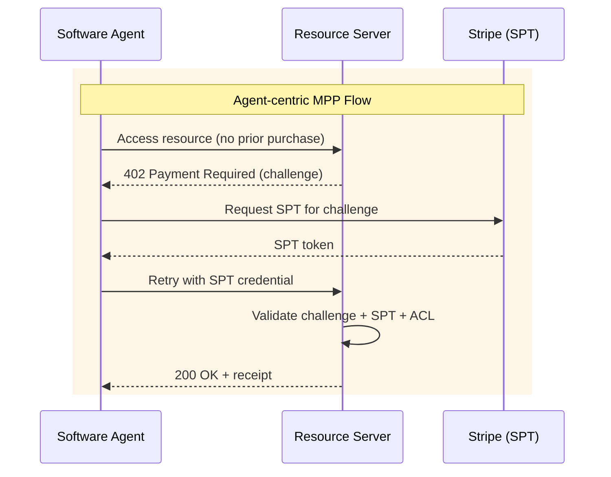
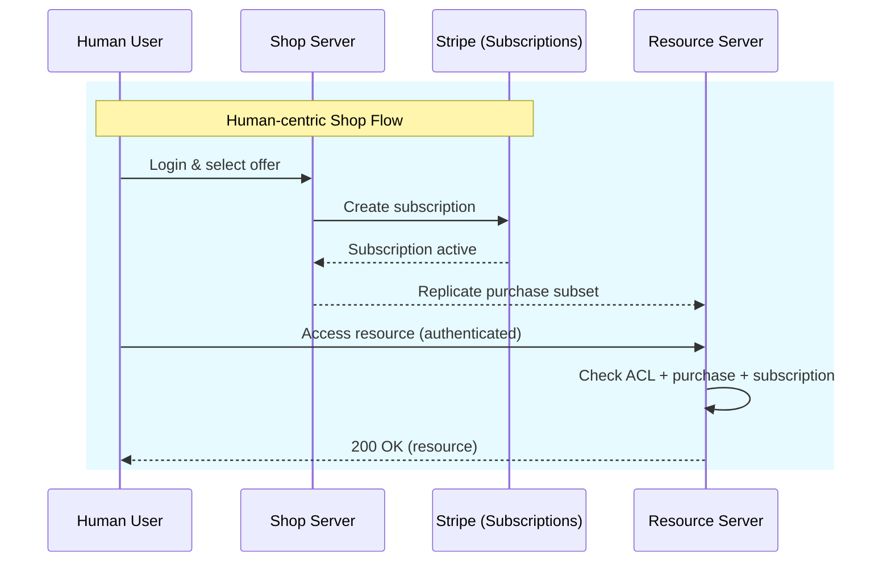

# ACP Client Skill

Execute checkout, cart, and order operations against the OpenLink Adaptive
Commerce Platform (ACP) API using composable `curl` recipes. Triggered by
natural-language purchase intents.

## When to Use

- "I want to purchase `{product}`" / "Buy `{product}`" / "Get me a license for `{product}`"
- "Checkout `{product}`" / "Create a checkout for `{offer-id}`"
- "Update checkout `{id}`" / "Change quantity for checkout `{id}`"
- "Cancel checkout `{id}`" / "Cancel my order"
- "Complete checkout `{id}`" / "Pay for checkout `{id}`"
- "Add `{product}` to cart" / "Create a cart for `{product}`"
- "Get order `{order-id}`" / "Check status of order `{order-id}`"
- "Get a Stripe test token" / "Generate SPT for `{amount}`"
- "Use balance" / "Pay with balance"
- Any request referencing the ACP API, checkout sessions, carts, or OpenLink
  software license purchases.
- Accessing a paid/protected resource behind a 402 (MPP) paywall, when the
  authentication protocol (WebID-TLS/NetID-TLS, OAuth, Digest) or settlement
  route must be elicited. WebID-TLS/NetID-TLS always targets port 5443, never
  443 — see the Auth Protocol Selection rule.

## Prerequisites

- `curl` installed
- `jq` recommended (fallback `awk` JSON parsers provided)
- `ACP_AUTH_TOKEN` environment variable set, or user must obtain one manually
- `STRIPE_API_KEY` required for `complete` and `spt` flows

## ACP Instances

Known ACP API endpoints. The default is `shop.openlinksw.com`; override via `ACP_BASE_URL`:

| Instance | URL |
|---|---|
| **Shop (default)** | `https://shop.openlinksw.com/acp` |
| QA / Staging | `https://ods-qa.openlinksw.com/acp` |

To use a non-default instance, set `ACP_BASE_URL` before invoking the skill:
```bash
export ACP_BASE_URL="https://ods-qa.openlinksw.com/acp"
```

## Environment Variables

| Variable | Required | Default |
|---|---|---|
| `ACP_BASE_URL` | No | `https://shop.openlinksw.com/acp` |
| `ACP_API_VERSION` | No | `2026-01-30` |
| `ACP_AUTH_TOKEN` | **Yes** | Prompted if missing |
| `ACP_ITEM_ID` | No | Resolved from product catalog or user input |
| `STRIPE_API_KEY` | Yes (for complete/spt) | Prompted if missing |
| `STRIPE_PAYMENT_METHOD` | No | `pm_card_visa` |
| `STRIPE_SPT_CURRENCY` | No | `usd` |
| `STRIPE_SPT_MAX_AMOUNT` | No | `1000` |
| `STRIPE_SPT_EXPIRES_AT` | No | `now + 1 hour` (auto-computed) |

## Intent-to-Flow Mapping

When the user expresses a natural-language intent, map it to the corresponding
ACP flow:

| User Intent | Skill Flow |
|---|---|
| "I want to purchase `{product}`" | **Full purchase**: `create_checkout` → `get_checkout_total` → (`balance` or `spt`) → `complete_checkout` |
| "Checkout `{product}`" | `create_checkout` → return checkout session ID and total |
| "Update checkout `{id}`" | `update_checkout` — change items/quantity |
| "Cancel checkout `{id}`" | `cancel_checkout` — cancel with `reason_code: buyer_cancelled` |
| "Complete checkout `{id}`" | `complete_checkout` — fetch total, get SPT, complete |
| "Add `{product}` to cart" | `create_cart` → return cart ID |
| "Get order `{order-id}`" | `get_order` |
| "Get Stripe SPT" | `get_test_spt` |
| "Use balance" / "Pay with balance" | `complete_checkout` with `handler_id: "balance"` |

## Product Resolution

When the user names a product (e.g., "JDBC to ODBC bridge driver"), resolve it
to an offer IRI using the catalog in `references/product-catalog.md`. Match
against:

- `schema:name`
- `skos:prefLabel`
- `skos:altLabel`
- `schema:description`

If no match is found, ask the user for the full offer IRI or product URL.

## Bearer Token Acquisition (Manual)

If `ACP_AUTH_TOKEN` is missing or invalid:

1. **Prompt the user**: "ACP bearer token not found. Please obtain one from the
   OAuth applications page."
2. **Provide URLs**:
   - Primary: `https://ods-qa.openlinksw.com/oauth/applications.vsp`
   - Alternative: `https://shop.openlinksw.com/oauth/applications.vsp`
   - Additional: any other Virtuoso instance the user specifies
3. **Instructions**:
   - Navigate to the URL
   - Log in via the authentication form (Digest, WebID-TLS, or social login)
   - Register a new OAuth application
   - Copy the generated bearer token
   - Export as `ACP_AUTH_TOKEN` or paste when prompted

## Browser Automation

The skill uses [Playwright](https://playwright.dev) (`playwright-cli`) for
browser automation. PinchTab is a fallback if Playwright is unavailable.

Set the wrapper script path before use:
```bash
export PWCLI="{REPO_ROOT}/.opencode/skills/playwright/scripts/playwright_cli.sh"
```

### Prerequisites

- `npx` (comes with Node.js/npm)
- Playwright browsers installed (first use): `npx playwright install chromium`

### Workflow

1. Open page in headed mode: `"$PWCLI" open <url> --headed`
2. Snapshot for element refs: `"$PWCLI" snapshot`
3. Interact with elements by ref (e.g., `"$PWCLI" click e79`)
4. Capture screenshots or PDFs as needed

## Subscription Payment Detection

After `complete_checkout`, the response may contain a `links` array with a
`subscription_payment` entry. When present:

1. Extract the `href` value from the link with `rel: "subscription_payment"`
2. Open the link with Playwright:
   ```bash
   "$PWCLI" open <href> --headed
   "$PWCLI" snapshot
   ```
3. Present the snapshot to the user showing the payment form.
4. Ask the user if they want to proceed with payment.

## Checkout Body Format

The `create_checkout` and `update_checkout` operations use `items` (not
`line_items`) and `capabilities` as an empty object:

```json
{
  "items": [
    { "id": "http://data.openlinksw.com/oplweb/offer/Offer-2020-10-virtuoso-8-app-developer-development-WKS-ANY#this", "quantity": 1 }
  ],
  "currency": "usd",
  "capabilities": {}
}
```

## Output Format

- **Default**: Human-readable summary (checkout ID, order ID, status, total,
  receipt, subscription payment link if present)
- **`--json` flag**: Raw JSON from the API response, stable machine-readable
  output for agent consumption

## Post-Purchase File Access Verification

After a checkout is completed and the subscription payment is processed, verify
that the purchased file/resource is accessible:

1. **Resolve the resource URL** from the offer IRI — typically the offer's
   `schema:subjectOf` or the resource's canonical DAV/WebDAV path on the
   ACP instance.

2. **Fetch with On-Behalf-Of delegation** using the ACP bearer token:
   ```bash
   curl -sI -H "Authorization: Bearer ${ACP_AUTH_TOKEN}" \
     -H "On-Behalf-Of: {resource-iri}" \
     "{resource-url}"
   ```
   > **IMPORTANT**: The `On-Behalf-Of` header value must be a **bare WebID URI — no angle brackets**. Correct: `-H "On-Behalf-Of: https://example.com/path#fragment"`. Angle brackets cause delegation resolution failure (402/401). The `{resource-iri}` placeholder uses curly braces conventionally — the actual value is a bare IRI.

   - `200 OK` → access granted, file is available
   - `401 Unauthorized` → provisioning may be async; retry after a short delay
   - `403 Forbidden` → access not granted; check order/subscription status
   - `404 Not Found` → wrong resource URL; verify path

3. **Report result** to the user: confirmed accessible, or explain the issue.

## MPP Purchase Flow for Protected Resources (Protocol-Agnostic)

Use this flow when accessing a paid resource behind a **402 Payment Required**
paywall (MPP) — e.g., files under a `daas_paid` collection on
`linkeddata.uriburner.com`. The 6-step MPP machinery (401 → authenticate →
`302 ?k=` → `402` challenge → obtain SPT → settle → `200` + receipt) is
independent of the authentication protocol used to reach the resource server.
**WebID-TLS (mTLS) is one protocol option among several** — OAuth (Bearer) and
Digest are others. Select the protocol by elicitation when it is not clearly
discernible from the prompt. In both settlement routes the **ACP shop is the
merchant of record**: it owns the Stripe account and the offer catalog
(`externalId = offer_iri` in the 402 challenge). What differs is the **flow**:
Route A is **agent-centric MPP** — the agent obtains an SPT from Stripe and
presents it to the resource server, which validates the challenge + SPT + ACL
and returns the resource with a receipt; Route B is **human-centric shop flow**
— a human user buys via the shop (Stripe subscription), the shop replicates the
purchase subset to the resource server, and the user then accesses the resource
authenticated.

### Auth Protocol Selection (Elicitation)

Pick the authentication protocol before acting. Ask the user if not inferable
from the prompt:

| Signal | Protocol |
|---|---|
| Client certificate / principal WebID / NetID / `:5443` / "my cert" / "WebID-TLS" / "NetID-TLS" | **WebID-TLS (mTLS)** |
| `ACP_AUTH_TOKEN` / Bearer token / OAuth application / On-Behalf-Of delegation | **OAuth (Bearer)** |
| Username/password / WebDAV ACL / "Digest" | **Digest** |
| Any other protocol the user names | Use the user's protocol |

Elicitation prompt when ambiguous:
> "This paid resource is protected by MPP and supports multiple authentication
> protocols. Which should I use: (1) WebID-TLS (mTLS), (2) OAuth (Bearer), or
> (3) Digest?"

If the user specifies a protocol explicitly, honor it.

> **RULE — WebID-TLS/NetID-TLS port defaults to 5443 automatically, not by
> discovery.** The instant WebID-TLS (or NetID-TLS — same mechanism) is
> selected, construct or rewrite the target URL onto port **5443** before the
> first request. Do not probe port 443 first and fall back to 5443 only after
> a `401`. Port 443 on these resource servers never issues a
> `CertificateRequest` during the TLS handshake — it falls straight through to
> a Digest challenge regardless of what certificate is available, which reads
> exactly like "this resource has no WebID-TLS option" even when it does.
> Verified live 2026-08-19 against `ods-qa.openlinksw.com`: `:443` → `401
> Digest`, no `CertificateRequest` in the handshake at all; `:5443` →
> `CertificateRequest` issued, cert accepted, `302` to a `?k=...` capability
> URL, which only then returns the real `402`. Full detail in
> **Protocol-Specific Notes** below and in the sibling `x402-buyer` skill's
> `references/protocol.md`.
>
> Rewrite only when the URL is on port 443 or has no explicit port. A URL
> already naming some other explicit port (a local/staging server on a custom
> port) is left untouched — treat that as a deliberate override, not a miss.

### Settlement Route Selection (Elicitation)

Pick the route before acting. Ask the user if not inferable from the request:

| Signal | Route |
|---|---|
| Non-UI / headless agent; no `ACP_AUTH_TOKEN`; single resource fetch; "settle the SPT directly" | **A — Agent-Centric MPP Flow** |
| Interactive/UI human user; shop login; subscription lifecycle; purchase replication to the resource server | **B — Human-Centric Shop Flow** |

Elicitation prompt when ambiguous:
> "This paid resource supports two flows: (A) agent-centric MPP — the agent
> presents an SPT directly to the resource server which validates it; or (B)
> human-centric shop flow — a user buys via the shop (Stripe subscription),
> the shop replicates the purchase to the resource server, and the user
> accesses the resource authenticated. Which flow should I use?"

### Route A — Agent-Centric MPP Flow (non-UI agent)



Route A notes:

1. **The agent has no prior purchase.** The first request hits the resource
   server unauthenticated (or unentitled) and receives the `402 Payment
   Required` challenge: `WWW-Authenticate: Payment id, method=stripe,
   intent=charge, request=base64(amount, currency, externalId=offer_iri,
   recipient=shop_iri, methodDetails)` plus `Link: offer_iri; rel=schema.org/offers`.

2. **The SPT is obtained out of band from Stripe** — in test mode via
   `POST https://api.stripe.com/v1/test_helpers/shared_payment/granted_tokens`
   (payment_method `pm_card_visa`, usage_limits currency/max_amount, expires_at).

3. **Present the SPT by echoing the challenge**: `Authorization: Payment
   base64({payload:{spt}, challenge})` on the challenged resource URL. The
   server decodes payload → spt/request/externalId, validates the challenge +
   SPT + ACL, writes `Purchase(PurchasePending)` → `PurchaseCompleted` to the
   purchase graph, and settles with Stripe.

4. **Success is signalled by `200 OK` + `Payment-Receipt: receipt` header**,
   where `receipt = base64url({method:stripe, status:success, timestamp,
   reference:pi_id})`. Re-access with the same challenge replays idempotently.

5. **No shop/ACP participant is involved** — the resource server settles
   directly. The ACP shop remains the merchant of record (owns the Stripe
   account and the offer catalog referenced by `externalId`).

### Route B — Human-Centric Shop Flow (interactive / UI user)



Route B notes:

1. **The human user logs in to the shop and selects an offer.** The shop is the
   merchant of record: it owns the Stripe account and the offer catalog
   (`externalId = offer_iri` in the 402 challenge).

2. **The shop creates a Stripe subscription** for the selected offer on the
   merchant account. The subscription becomes active once its initial invoice
   is paid — this is the "Subscription active" step, e.g. via the hosted
   invoice (`subscription_payment` link) paid through the browser.

3. **The shop replicates the purchase subset to the resource server.** The
   shop writes the entitlement (principal → offer) into the resource server's
   purchases graph, so the resource server can authorize the buyer without
   re-contacting the shop.

4. **The user accesses the resource authenticated.** The resource server checks
   its ACL **plus** the purchases graph **plus** the subscription state, and
   returns `200 OK (resource)` when the entitlement holds.

### Protocol-Specific Notes

- **WebID-TLS (mTLS)**: default to `:5443`, not `:443`, the moment this
  protocol is selected — see the RULE in Auth Protocol Selection above. Port
  443 returns `401` (WebDAV ACL) even with a valid client cert, because the
  server never requests one on that port; it isn't a fallback path, it's a
  dead end for this protocol. Request the resource on
  `https://{host}:5443/...` (e.g. `https://linkeddata.uriburner.com:5443/...`)
  with the WebID-TLS cert to trigger the `302 ?k=...` redirect that precedes
  the `402` challenge. Present the principal's client certificate on every
  hop — the initial request, the `?k=...` follow-up, AND the eventual
  payment-retry request; the authenticated principal WebID is the
  `service_id`.
- **OAuth (Bearer)**: authenticate with `Authorization: Bearer {token}`
  (e.g., `ACP_AUTH_TOKEN`); for delegated resource access use the `On-Behalf-Of`
  header with a **bare WebID URI — no angle brackets** (angle brackets cause
  delegation resolution failure, 402/401). The `{resource-iri}` placeholder uses
  curly braces conventionally — the actual value is a bare IRI.
- **Digest**: authenticate with HTTP Digest credentials (username/password)
  against the WebDAV ACL before MPP 401/402 handling applies.

### Shared Implementation Notes (both routes)

1. **WebID-TLS session reuse trap**: disable TLS session reuse (`agent: false`)
   for every hop. Node's default `https` agent resumes the TLS session on the
   follow-up `?k=` request, and the resource server loses the WebID-TLS
   principal binding — returning `401 Permission denied to <WebID>` instead of
   the expected 302/402. Each request must use a fresh TLS connection. (Symptom:
   curl succeeds but Node fails.)

2. **Use generous timeouts** (~90-170 s per hop); the 302/402 hops on the
   resource server are slow (30+ s each).

### Access Verification

After the SPT settles (Route A) or the shop replicates the purchase subset
(Route B), re-run the authenticated probe against the resource server (fresh
connection each hop) and check for `200 OK`:

- Route A: `200 OK` + `Payment-Receipt: receipt` → access granted (idempotent
  replay of the completed purchase)
- Route B: `200 OK` → access granted (resource server checks ACL + purchase +
  subscription from the replicated purchase subset)
- `402` / `401 Permission denied to <identity>` → purchase not recorded or not
  yet propagated; retry after cache-propagation delay, then escalate the
  resource-server → purchase-graph → access-ACL binding server-side.

## Error Handling

- `401 Unauthorized` → Bearer token missing or invalid; direct user to OAuth
  applications page
- `404 Not Found` → Checkout/cart/order ID does not exist
- `409 Conflict` → Idempotency key collision; retry with new UUID
- Stripe errors → Report Stripe error message and raw response
- Missing `jq` → Fall back to bundled `awk` JSON parsers (`_json_str`,
  `_json_total`, `_json_sub_payment_url`)

## JSON Helper Functions

The skill bundles three portable JSON extraction functions that work with or
without `jq`:

- `_json_str FIELD` — extract a top-level string field from stdin JSON
- `_json_total` — extract `amount` where `type=="total"` from the `totals` array
- `_json_sub_payment_url` — extract `subscription_payment` href from `links[]`

See `references/acp-api-operations.md` for implementation details.

## References

- `references/acp-api-operations.md` — Full curl recipes for every endpoint
- `references/oauth-token-setup.md` — Step-by-step manual token guide
- `references/product-catalog.md` — Offer IRI mappings from TTL sources

## Anti-Drift Protocol

⛔ **PRE-BUILD CHECK**: Before producing any curl command or output, re-read the
relevant operation section in `references/acp-api-operations.md`. Confirm headers,
body shape, and placeholder substitution. Build to pass — do not retro-fit.

## Examples

See `examples/checkout-flow.sh` and `examples/cart-flow.sh` for complete
executable workflows.

## Attribution

Derived from `acp_curl.sh` — reworked into composable curl recipes for agent use.