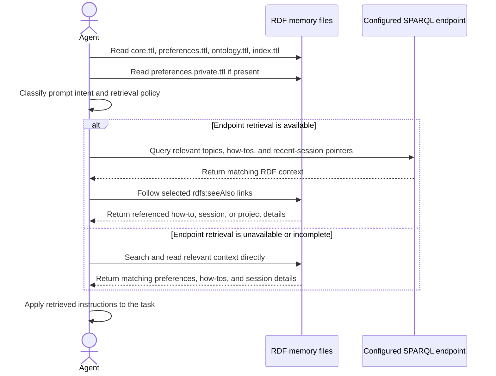

# Agent RDF Memory

A queryable behavioral contract for AI agents, encoded in RDF-Turtle. It defines how an agent retrieves and applies standing instructions, with RDF memory files serving as the authoritative source.

## Folder structure

```text
agent-rdf-memory/
├── README.md                         ← this file
├── core.ttl                          ← user identity, agent identity template, output paths
├── preferences.ttl                   ← public-safe hub: topic groupings and HowTo steps
├── preferences.private.ttl           ← optional local-only private overlay (gitignored)
├── preferences.private.example.ttl   ← public template for private overlays
├── ontology.ttl                      ← vocabulary: triggers, prompt intents, context routing
├── index.ttl                         ← session index: one schema:ListItem per session
├── howto/                            ← companion specifications, one per sub-HowTo
│   ├── agent-identity.ttl
│   ├── artifact-routing.ttl
│   ├── canonical-entity-iri-denotation.ttl
│   ├── …                             ← see the Sub-HowTo map below
│   └── youid-validation-gates.ttl
├── sessions/                         ← episodic memory (YYYY-MM-DD-{llm}-{env}.ttl)
├── projects/                         ← project-specific knowledge
├── entities/                         ← people, organizations, tools, and concepts
│   └── people.ttl                    ← local/gitignored; start from people.example.ttl
└── scripts/                          ← validation and utility tools
```

## Retrieval protocol

Before acting on a task, the agent must:

1. List `agent-rdf-memory/` and its subfolders.
2. Read `core.ttl`.
3. Read the public `preferences.ttl`.
4. If present, read `preferences.private.ttl`. Its assertions override public defaults.
5. Read `ontology.ttl` for prompt-intent classes, retrieval policies, and context-routing rules.
6. Read `index.ttl` for session pointers.
7. Classify the current prompt intent and, when available, use the configured SPARQL endpoint to select relevant context.
8. Follow selected `rdfs:seeAlso` links to relevant `howto/*.ttl`, session, or project files.
9. If endpoint retrieval is unavailable or incomplete, retrieve the required context directly from files.

The sequence below summarizes the retrieval flow. File reads establish the baseline context; endpoint retrieval selects additional relevant context when available.



See `howto/session-governance.ttl` for the full protocol.

## Preferences structure

`preferences.ttl` uses a hub-and-spoke model:

```text
:agentBehaviorGuide (hub)
├── schema:about    → topic entities for conceptual grouping
└── schema:hasPart  → sub-HowTos that organize schema:step lists
```

Each sub-HowTo has `rdfs:seeAlso` links to companion `howto/*.ttl` files containing the detailed specification. Steps in `preferences.ttl` provide concise pointers; the companion files hold the rationale, examples, gates, and incident notes.

## Public and private preferences

`preferences.ttl` is intended to be public-safe. Reusable behavioral rules, public how-to links, and shared operational structure belong there.

Personal endpoint order, identity-specific defaults, private paths, credentials, and other local-only preferences belong in `preferences.private.ttl`. The file is gitignored and optional. When present, the harness loads it as an overlay on the public graph. Use `preferences.private.example.ttl` as the public template for its structure.

## Ontology-routed SPARQL context selection

`ontology.ttl` defines prompt-intent and context-routing vocabulary, including `:PromptIntent`, `:RetrievalPolicy`, `:routesToTopic`, `:requiresHowTo`, `:optionalHowTo`, `:preferredContextSource`, and `:requiresRecentSession`.

The general retrieval flow is:

1. Bootstrap from the public memory files and, if present, the private overlay.
2. Classify the prompt intent. For example, a Virtuoso troubleshooting task may use `:VirtuosoSparqlTroubleshooting`; other systems and task domains should have their own intent classes.
3. Run a SPARQL `SELECT` against the configured endpoint and graph IRIs to retrieve relevant preference topics, how-to references, retrieval rules, and recent-session context.
4. Read the selected how-to and session files for details.
5. Fall back to direct file retrieval when endpoint-based selection is unavailable or incomplete.

## Sub-HowTo map

| # | Sub-HowTo | Steps | Primary how-to files |
| --- | ----------- | ------- | ---------------------- |
| 1 | `:howto-identity-webid` | 14 | `agent-identity`, `verified-identity`, `youid-delegation`, `webid-verification-services`, `webid-verification-table`, `delegation-insert-gate`, `youid-validation-gates` |
| 2 | `:howto-memory-management` | 16 | `session-governance`, `memory-protocol-gate`, `token-optimized-session-handoff`, `sparql-memory-loading`, `no-unauthorized-deletion`, `no-memory-md-write` |
| 3 | `:howto-artifact-routing` | 7 | `artifact-routing`, `remote-webdav-upload` |
| 4 | `:howto-rdf-authoring` | 19 | `canonical-entity-iri-denotation`, `entity-iri-denotation-mechanics`, `canonical-iri-compliance-gate`, `entity-type-gate`, `external-iri-verification`, `entity-link-placement`, `concept-entity-hyperlinking`, `faq-entity-iri-gate`, `sparql-absolute-prefix-iri`, `entity-href-companion-ttl`, `owl-sameas-vs-skos-related`, `entity-lookup-disambiguation`, `rdf-residence-vs-birthplace`, `no-blank-nodes-resolver-entities`, `rdf-document-authoring` |
| 5 | `:howto-html-kg-explorer` | 38 | `infographic-authoring`, `kg-explorer-ui-patterns`, `kg-explorer-d3-patterns`, `kg-explorer-reuse-first`, `harness-contract-compliance`, `rdf-infographic-compliance-gate`, `rdf-infographic-gated-workflow`, `footer-sparql-explorer-gate`, `sparql-html-escape-gate`, `study-prior-patterns`, `kg-curation-attribution`, `ui-ux-expert-persona` |
| 6 | `:howto-ontology-generation` | 2 | `ontology-cross-reference-gate`, `owl-property-characterization`, `ontology-discovery` |
| 7 | `:howto-skill-workflows` | 6 | `skill-invocation`, `opal-session-vocabulary`, `uriburner-oauth-authcode-flow` |
| 8 | `:howto-virtuoso-sparql` | 2 | `virtuoso-sparql-formats`, `virtuoso-workbench-query-dedup` |
| 9 | `:howto-terminology` | 1 | `artifact-routing`, `rdf-document-authoring` |

**Total: 105 steps across 9 themes.**

The map includes a Virtuoso-specific topic because the current repository has Virtuoso-specific procedures. Deployments for other platforms can add their own domain-specific topics.

## Querying preferences

### SPARQL example

This query illustrates retrieving steps for a topic from a loaded RDF graph. Replace the graph and namespace configuration to match the target store and dataset.

```sparql
# Example: retrieve the steps for the RDF-authoring topic
SELECT ?step ?pos ?name WHERE {
    :howto-rdf-authoring schema:step ?step .
    ?step schema:position ?pos ;
          schema:name ?name .
}
ORDER BY ?pos
```

### File-based example

This shell example searches the repository files for a step identifier:

```bash
rg -l "schema:step.*step-whoamiFormat" agent-rdf-memory/preferences.ttl
```

Use the file-search tool available in the environment.

## Adding a new rule

1. Decide which sub-HowTo owns the rule, or create a new sub-HowTo if none fits.
2. Add a `schema:HowToStep` entry to `preferences.ttl`.
3. Add the step to the owning sub-HowTo's `schema:step` list.
4. Write the full specification to the companion `howto/<topic>.ttl` file.
5. If creating a new sub-HowTo, add it to `:agentBehaviorGuide` using `schema:hasPart`, add a topic entity, and update this README.

## RDF Platform Usage Examples

The examples below show how RDF memory access can be configured for different platforms. Each example identifies the endpoint and graph-IRI details for that platform.

### General endpoint pattern

Use a runtime placeholder for the configured endpoint rather than assuming a particular server or port. Here, `{CNAME}` represents the selected endpoint host; it is not a literal hostname.

```text
https://{CNAME}/sparql
```

Bind `{CNAME}` to the endpoint selected for the current task. The actual endpoint may be local, remote, or user-specified.

### Virtuoso

These examples apply to the stated Virtuoso configurations. Other Virtuoso installations may use different endpoint settings or graph IRIs.

**Local endpoint example:** A local Virtuoso instance listening on port `8890` over HTTP may use:

```text
http://localhost:8890/sparql/
```

Use the endpoint actually configured for the target instance. It may use HTTPS or a different port.

**RDF Import DET graph and entity IRI examples:** In Virtuoso, an RDF Import DET is a dynamic WebDAV folder configured to automatically load RDF documents placed in it into Virtuoso’s Quad Store, its RDF data management engine. A local RDF Import DET load may use a graph IRI such as:

```text
urn:dav:/DAV/home/{USER}/rdf-import-test/{file}.ttl
```

Entity IRIs in that graph may use a different base, such as:

```text
http:/DAV/home/{USER}/rdf-import-test/{file}.ttl#entity
```

Discover the actual graph and entity IRIs from the target store before constructing context-selection queries. A grouped query using `SAMPLE()` can help inspect graph, type, count, and sample-subject values.

### Other RDF platforms

Add platform-specific examples here, following the same format: name the platform, show its endpoint or graph-IRI patterns, and identify the configuration they represent.

## Related

- `AGENTS.md` — Codex-facing protocol entry point
- `SESSION-START-HOOK.md` — runtime injection and SPARQL-preferred context-selection design
- `preferences.private.example.ttl` — public template for local-only private preference overlays
- `scripts/validate-memory-protocol.py` — post-session audit tool

## SHACL validation (structure) and content sync

The store has SHACL shapes in `shapes/memory-shapes.ttl`. They cover session document entities (dated, with `schema:about`), index list items, and HowTo steps.

```bash
python3 scripts/validate-memory-shapes.py                 # report all files, exit 0
python3 scripts/validate-memory-shapes.py --strict        # exit 1 on any violation
python3 scripts/session-graph-gate.py check --all         # compares triple sets with the Virtuoso graphs
```

Report-only is the default. Older files that fail the shapes are reported, not edited. See `howto/memory-shacl-validation.ttl` and preferences Step 325.
